# YPWI Web Application - Application Flow & Architecture

## 📋 Overview

Aplikasi web YPWI adalah sistem manajemen sekolah multi-tenant yang terintegrasi untuk 26 unit sekolah Yayasan Pesantren Wahdah Islamiyah Luwu Timur.

## 🏛️ System Architecture

### High-Level Architecture

```
┌─────────────────────────────────────────────────────────────────┐
│                    YPWI Web Application                         │
│                                                                 │
│  ┌─────────────┐    ┌─────────────┐    ┌─────────────────────┐  │
│  │   Frontend  │    │   Backend   │    │     Database        │  │
│  │   (HTML/JS) │◄──►│ (Node.js)   │◄──►│     (MySQL)        │  │
│  │             │    │             │    │                     │  │
│  │ • Landing   │    │ • REST API  │    │ • Multi-tenant DB   │  │
│  │ • Dashboards│    │ • Auth      │    │ • 27 Tenants        │  │
│  │ • Forms     │    │ • File Upload│    │ • User Management  │  │
│  └─────────────┘    └─────────────┘    └─────────────────────┘  │
└─────────────────────────────────────────────────────────────────┘
                                                                      │
┌─────────────────────────────────────────────────────────────────┐   │
│                    External Integrations                         │   │
│                                                                 │   │
│  ┌─────────────┐    ┌─────────────┐    ┌─────────────────────┐  │   │
│  │ WhatsApp API│    │   File      │    │   Authentication    │  │   │
│  │ (Whacenter) │    │  Storage    │    │     (JWT)          │  │   │
│  └─────────────┘    └─────────────┘    └─────────────────────┘  │   │
└─────────────────────────────────────────────────────────────────┘   ▼
```

## 🔄 Application Flow

### 1. User Authentication Flow

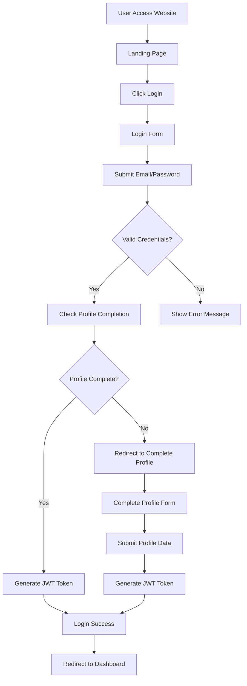

### 2. Multi-tenant Data Flow

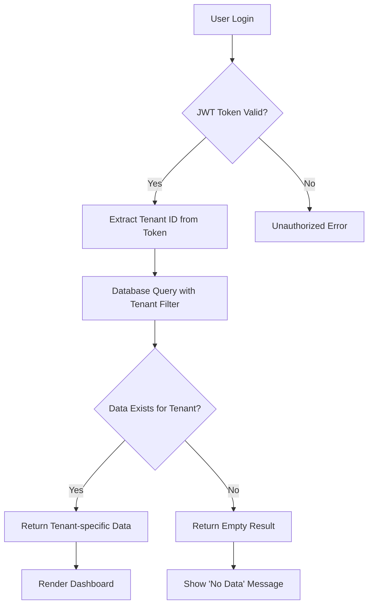

### 3. Attendance System Flow

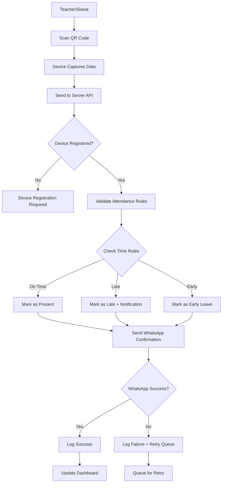

### 4. Content Management Flow

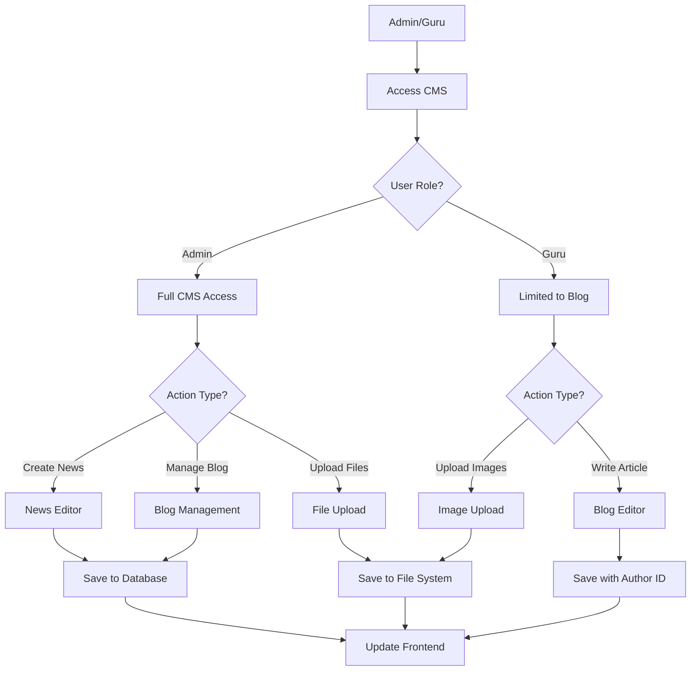

## 📊 Database Relationships

### Core Entity Relationships

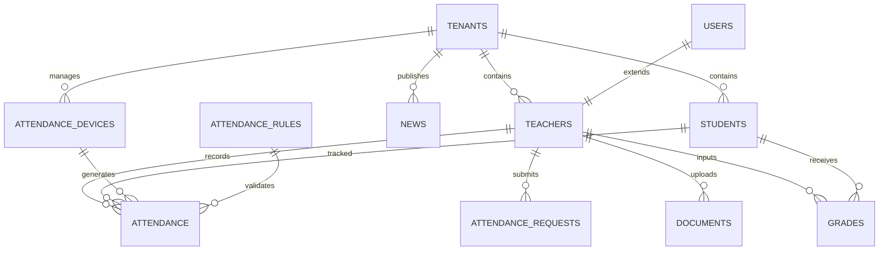

### Multi-tenant Isolation

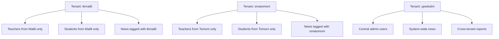

## 🔐 Security Flow

### Authentication & Authorization

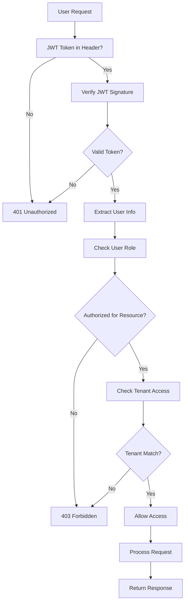

### File Upload Security

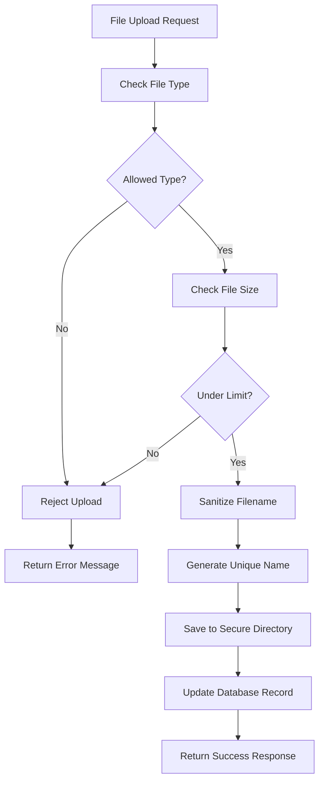

## 📱 API Request Flow

### Typical API Call Sequence

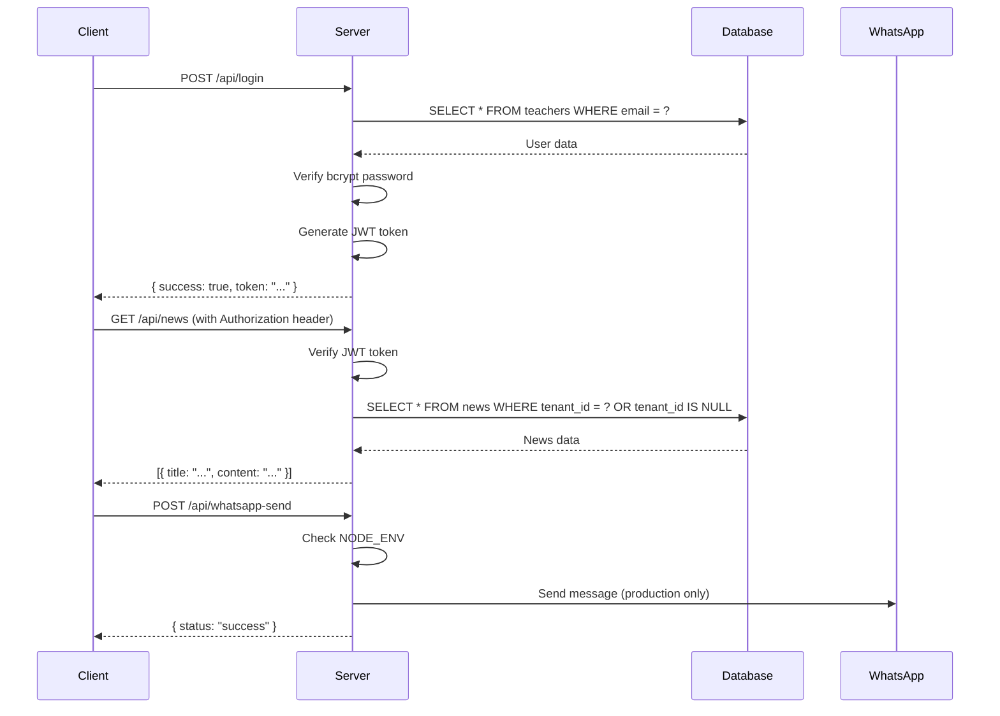

## 🔄 Data Synchronization Flow

### Cross-tenant Data Access

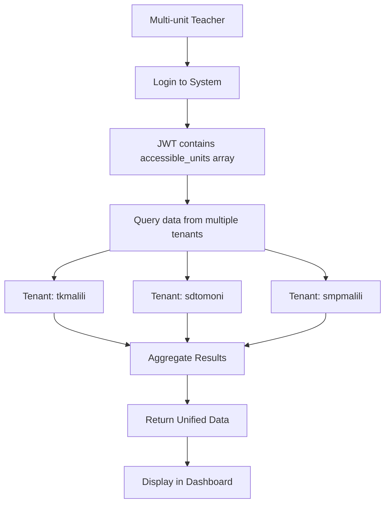

## 📈 Performance Optimization Flow

### Database Query Optimization

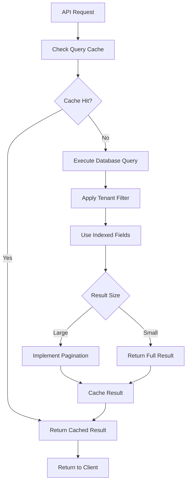

## 🚨 Error Handling Flow

### Comprehensive Error Management

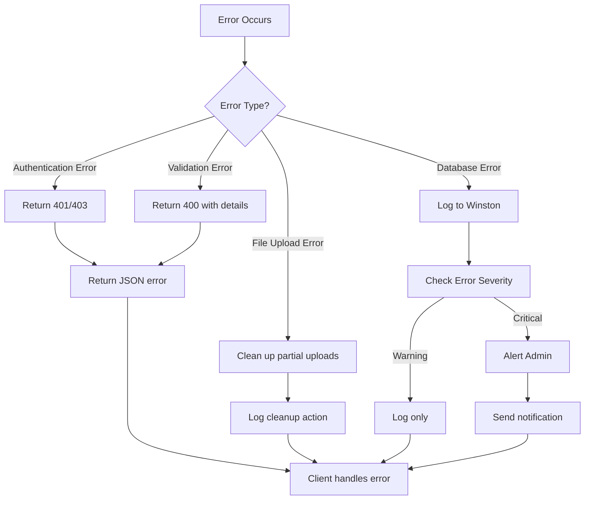

## 📋 Development Workflow

### Feature Development Cycle

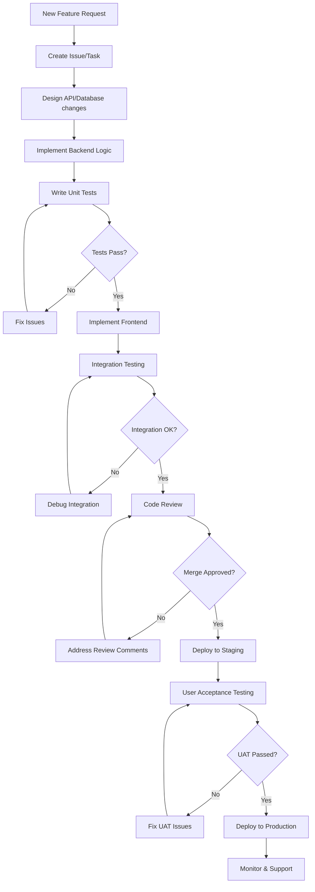

---

## 📚 Additional Documentation

- [API Documentation](./api-docs.md)
- [Database Schema](./database-schema.md)
- [Deployment Guide](./deployment.md)
- [Security Guidelines](./security.md)
- [Troubleshooting](./troubleshooting.md)